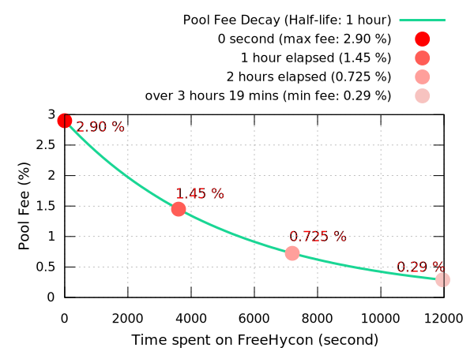
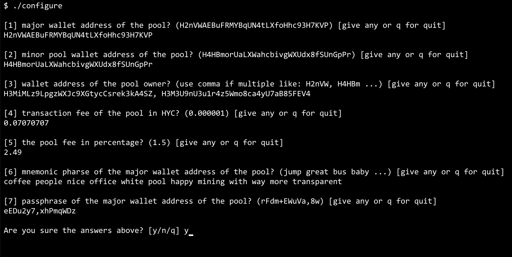

<p align="center">  </p>

# FreeHycon

The *most transparent and efficient HYCON mining pool* implementation ever

### Background 

At the early stage of [HYCON](http://explorer.hycon.io) blockchain, there were not many pools efficient. Moreover, some miners have begun to question the transparent distribution of profits because most of pools did not reveal their books at that time.

[JWLee](<https://github.com/leejw51>) and I felt we need to solve this. To miners, it was the most fundamental right that should not be infringed.

Based on `cluster`(*multi-core server manager*) and *publish/subscribe* of `RabbitMQ`, we implemented the following:

- The most efficient *HYCON mining pool* implementation ever
- *Transparently disclosure* all the books through the web dashboard in real-time
- Fair profit sharing using the banker database *even if the server is in trouble*

### Performance 

I benchmarked it several times, it showed a pretty good mining probability. Basically it simply follows the hashrate the pool has, but the degree of pool optimization mattered due to the relatively big network latency.   
Unfortunately, the data is gone but were shared with the miners. At that time the strong impact of `FreeHycon` is still alive in our memories :-)     
Miners will admit it.


### Features 
- Fully anonymous mining
- Fast hash rate estimation at under 10 mins
- Fair, fair and fair: you will be properly treated as exactly to your hash rate contribution
- For each block mined, the reward will be distributed immediately after 12 confirmations
- Fee policy: 0.29% - 2.90% varying with time (Half-life)


### How to build
`FreeHycon` is based on [`HYCON-Core`](https://github.com/Team-Hycon/hycon-core) and the path below `src/miner` is the full implentation of `FreeHycon`.  

```bash
$ tree docker
docker/
├── Dockerfile
├── README.md
├── build.sh
├── config.ts
├── config_example.png
├── configure
├── peerdbsql
├── run.sh
└── start.sh

## configure with your own parameter
## refer to an example below how to do this: 
$ cd docker 
$ ./configure 


## build directly a docker image for freehycon mining pool solution.
## it will take 5-10 mins.
$ ./build.sh

## then you can find the "freehycon" docker image here.
$ docker images

## run all the mining pool solution at once
$ ./start.sh --all 

## or run separately if needed
$ ./start.sh --main
$ ./start.sh --sub
$ ./start.sh --stratum
```




### Compatibility

Unfortunately, this mining pool only works under the version <= 0.0.9 (Nakamoto HYCON protocol).
We have stopped developing it for a while. Then, there were two hard forks including the implementation of [_GHOST protocol_](https://medium.com/@teamhycon/about-ghost-protocol-44006a245ad7) and reduction in mining reward.
`FreeHycon` does not support _Ghost Protocol_ for now but would be someday (really? -_-).  


